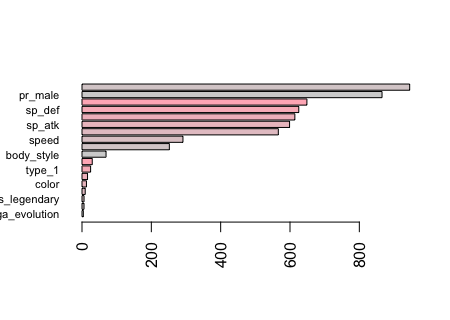
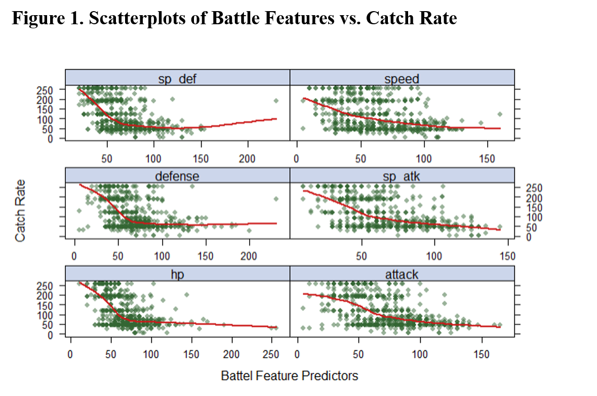

```{r include=FALSE, echo=FALSE, warning=FALSE, message=FALSE}
library(tidyverse)
library(RColorBrewer)
library(factoextra)
library(RColorBrewer)
library(gplots)
library(randomForest)
library(e1071)
library(ranger)
library(gbm)
library(xgboost)
library(lattice)
library(caret)
library(corrplot)
library(mgcv)
library(kableExtra)
library(vip)
library(patchwork)
library(kableExtra)
```

# 1. INTRODUCTION

## 1.1 Motivation and Objective

Pokemon are fictional creatures, which can be captured by players and trained to battle each other in the augmented reality game Pokémon Go!. In this project, we use a dataset from Kaggle that contains different attributes and catch rates for 721 unique Pokemons. We try to understand the relationship between Pokemons' different attributes and their respective catch rates. Here are some questions we want to answer: Which predictor(s) play important roles in predicting catch rates? Which type of model (linear or non-linear) serves as a better method to predict the catch rate?

## 1.2 Data Preparation and Cleaning

The original dataset has 20 predictors such as HP, and the outcome 'catch_rate'. After cleaning the names of these variables, I did the following steps to clean the data:

1.2.1 Notice that 'type_2' and 'egg_group_2' are indicators of if a pokemon has a second type or belongs to a second egg group. The 'Null' values in the data means the pokemon does not has the second type/group, so I changed them into "none" to make them as a category to be meaningful;

1.2.2 The 'generation' predictor is originally a numeric type, but it has only 6 integer values, so I decided to mutate it to be categorical;

1.2.3. Irrelevant variables 'number' and 'name' are dropped. 'total', which is the total base battle statistic for each pokemon, is calculated and reflected in other battle attributes such as 'hp' and 'attack'. So I dropped it to avoid intercollinearity. Later, after plotting the correlation map, I found 'weight_kg' and 'height_m' has relatively high correlation(correlation plot is shown in section 2). After consideration,  I chose to drop 'height_m' since it may has less effect on catch rate compared to 'weight_kg'. 'has_gender' is also dropped because all values are "TRUE".

```{r echo=FALSE, message=FALSE, warning=FALSE}
# data input
pkmn.df = read.csv("./pokemon.csv") %>%
  janitor::clean_names() %>%
  mutate(type_2 = replace_na(type_2, "none"),
         egg_group_2 = replace_na(egg_group_2, "none")
         ) %>%
  dplyr::select(-number, -total, -name, -has_gender) %>%
  na.omit()

factor.cols = c("type_1", "type_2", "is_legendary", "color", "egg_group_1", "egg_group_2", "has_mega_evolution", "body_style")

pkmn.df = pkmn.df %>% 
  mutate_at(factor.cols, funs(factor(.)))

# set training and testing
trRows = createDataPartition(pkmn.df$catch_rate,
                             p = 0.75,
                             list = FALSE)
```

# 2. Exploratory Analysis / Visualization

After plotting scatter plots for numerical predictors and boxplots for categorical predictors, significant trends were not observed in different types, egg groups, body_styles or colors. However, the battle attributes: 'hp', 'attack', 'defense', 'sp_atk', 'sp_def', and 'speed' seem to have a negative association with catch rate. While 'total' doesn't have an obvious trend. Therefore, we decided to keep specific battle features for analysis. 

The 'weight_kg' also seems to have negative association with catch rate. And the pokemons that are legendary have significantly lower catch rates. Below are some selected visualizations:

```{r echo=FALSE, message=FALSE, warning=FALSE}
theme1 <- trellis.par.get()
theme1$plot.symbol$col <- rgb(.2, .4, .2, .5) 
theme1$plot.symbol$pch <- 16
theme1$plot.line$col <- rgb(.8, .1, .1, 1) 
theme1$plot.line$lwd <- 2 
theme1$strip.background$col <- rgb(.0, .2, .6, .2) 
trellis.par.set(theme1)
#featurePlot(x = pkmn.df[, 3:8], y = pkmn.df$catch_rate,
#            plot = "scatter",
#            span = .5,
#            labels = c("Battel Feature Predictors","Catch Rate"), type = #c("p", "smooth"), layout = c(2,3))


# reread the data, since we need to use the 'total' variable here for visualization
pkmn.df.vis = read_csv("./pokemon.csv") %>% janitor::clean_names()
total.plot = ggplot(pkmn.df.vis, aes(x = total, y = catch_rate)) + 
  geom_point() +
  labs(title = "Figure 2. Scatterplot of total battle features vs. catch rate")

# checking correlation between continuous predictors
# height_m and weight_kg have high correlation = 0.63. So going to drop one of them, here I choose to drop height_m.
#cor(pkmn.df %>% dplyr::select(-c(type_1, type_2, generation, is_legendary, color, egg_group_1, egg_group_2, body_style, has_mega_evolution))) %>%
#  corrplot(method = "circle", type = "upper", diag = F)
```

# 3. Models

The dataset for analysis contains 644 samples and 18 predictors: 

* `type_1`: primary type
* `typw_2 `: second type, in case the Pokémon has it
* `hp`: health point
* `attack`: base attack
* `defense`: base defense
* `sp_atk`: attack speed
* `sp_def`: defense speed
* `speed`: base speed
* `generation`: number of the generation when the Pokémon was introduced
* `is_legendary`: Boolean that indicates whether the Pokémon is Legendary or not
* `color`: color of the Pokémon according to the Pokédex
* `pr_male`: probability of being a male Pokemon
* `egg_group_1`: egg group of the Pokémon
* `egg_group_2`: second egg group of the Pokémon, in case it has two
* `has_mega_evolution`: Boolean that indicates whether the Pokémon is able to Mega-evolve or not
* `height_m`: height of the Pokémon, in meters
* `weight_kg`: weight of the Pokémon, in kilograms
* `body_style`: body style of the Pokémon according to the Pokédex
* `catch_rate`: the response (on 0 - 255 scale)


The dataset is split into 75:25 training to test dataset. Based on our midterm project, We include GAM model, since it has a dominant performance among other methods(e.g. lda, qda, nb, lasso, ridge...), as a competitive model for predicting the catch rate. We also choose Boosting, Random Forest, Bagging, and Support Vector Machine models to train the data with cross validation. RMSE is used to compare and choose the final model. Finally, we use clustering to have a better visualization of pokemons that have similar attributes and to see if significant relationship between combat attributes and catch rate can be found.


## 3.1 GAM

Based on the visualization plots, we can see that some continuous variables have curve-like trend in the right tail. In this case, I consider using GAM model in order to include this trend into the analysis. For such predictors, I allow GAM to make it non-parametric smoothing term. GCV is used to choose the degree of freedom for the model. 

After fitting, it is observed that the smooth terms of 'hp', 'attack', 'defense', 'sp_atk', 'speed', and the coefficients of 'type_1Poison', 'type_2Water', 'generation3', 'pr_male', 'egg_group_1Undiscovered', 'body_stylemultiple_bodies', are significant. These result greatly coincides with the ones given by previous model.

```{r echo=FALSE, eval=FALSE}
set.seed(1)
gam_fit = gam(catch_rate ~ type_1 + type_2 + s(hp) + s(attack) + s(defense) + s(sp_atk) + s(sp_def) + s(speed) + generation + is_legendary + color + pr_male + egg_group_1 + egg_group_2 + has_mega_evolution + s(weight_kg) + body_style, data = pkmn.df[trRows, ])

#gam_plot = plot(gam_fit, scale = 0)
gam.rmse = sqrt(mean((pkmn.df$catch_rate[trRows] - predict(gam_fit, newdata = pkmn.df[trRows, ])) ^ 2)) # gam.rmse = 42.10908
```


## 3.2 Bagging, Boosting, Random Forest

We decide to use tree-based ensemble methods for regression. The function `randomForest()` implements Breiman's random forest algorithm for classification and regression, since our data is high dimensional, we also used function `ranger()` for training the random forest model. \newline
Since Random Forest does not have any underlying models, so it does not have assumptions, other than there is no multicollinearity among the variables.
\newline
For bagging, we used all 18 predictors for training. 

```{r echo=FALSE, message=FALSE, warning=FALSE, eval=FALSE}
# Bagging
set.seed(2021)
bagging <- randomForest(catch_rate ~ .,
                        pkmn.df,
                        subset = trRows,
                        mtry = 18)

bagging.pred = predict(bagging, newdata = pkmn.df[trRows,])
bagging.rmse = RMSE(bagging.pred, pkmn.df$catch_rate[trRows])
bagging.rmse # 19.34998

# Bagging using ranger
set.seed(2021)
bagging_2 <- ranger(catch_rate ~ .,
              pkmn.df[trRows,],
              mtry = 18,
              importance = "permutation") 
#barplot(sort(ranger::importance(bagging_2), decreasing = FALSE), las = 2, horiz = TRUE, cex.names = 0.7, col = colorRampPalette(colors = c("red", "pink"))(5))

pred.bag2 <- predict(bagging_2, data = pkmn.df[trRows,])$predictions
bag2.rmse = RMSE(pred.bag2, pkmn.df$catch_rate[trRows]) #18.90574


# Random Forest - fast implementation
set.seed(2021)
rf2.fit <- ranger(catch_rate ~ .,
              pkmn.df[trRows,],
              mtry = 6,
              importance = "permutation") 

pred.rf2 <- predict(rf2.fit, data = pkmn.df[trRows,])$predictions
rf.rmse2 = RMSE(pred.rf2, pkmn.df$catch_rate[trRows])
rf.rmse2 # 19.75706
```

Boosting primarily aims at reducing bias and variance. For boosting, we first did a grid search using `caret`. We then used the fast implementation of random forest when tuning the model and tuned the gbm model based on its result.

```{r echo=FALSE, message=FALSE, warning=FALSE, eval=FALSE}
 
ctrl <- trainControl(method = "cv") 

rf.grid <- expand.grid(mtry = 1:18,
                       splitrule = "variance",
                       min.node.size = 1:6)

set.seed(2021)
rf.fit <- train(catch_rate ~ . , 
                pkmn.df[trRows,], 
                method = "ranger",
                tuneGrid = rf.grid,
                trControl = ctrl)

ggplot(rf.fit, highlight = TRUE)
```

```{r echo=FALSE, warning=FALSE, message=FALSE, eval=FALSE}
# Boosting

gbm.grid <- expand.grid(n.trees = c(2000,3000,4000),
                        interaction.depth = 1:3,
                        shrinkage = c(0.001,0.003,0.005),
                        n.minobsinnode = c(1,10))
set.seed(1)
gbm.fit <- train(catch_rate ~ ., 
                 pkmn.df[trRows,], 
                 method = "gbm",
                 tuneGrid = gbm.grid,
                 trControl = ctrl,
                 verbose = FALSE)

gbm.pred = predict(gbm.fit, newdata = pkmn.df[trRows,])
gbm.rmse = RMSE(gbm.pred, pkmn.df$catch_rate[trRows])
gbm.rmse # gbm.rmse = 19.87961

gbm.plot <- ggplot(gbm.fit, highlight = TRUE)
ggsave(gbm.plot, file="gbm_plot.pdf", scale=2)
```


## 3.3 SVM

In SVM, we want to find a separating hyperplane that maximizes the gap between classes to optimally predict the outcome. Support Vector Machine with both linear and radial kernel is used to train the data. The tuning parameter epsilon(trade-off between correct classification and maximization of the gap) and gamma(how non-linear the fit could be) are tuned given a suitable range of numbers in the function.

```{r echo=FALSE, message=FALSE, warning=FALSE, eval=FALSE}
model.reg = svm(catch_rate ~ ., 
                data = pkmn.df[trRows,])
# print(model.reg)

# linear kernel
set.seed(2021)
svml.fit = tune.svm(catch_rate ~ .,
                    data = pkmn.df[trRows,],
                    kernel = "linear",
                    epsilon = exp(seq(-5, 0, len = 20)))

svml.pred = predict(svml.fit$best.model, newdata = pkmn.df[trRows,])
svml.rmse = RMSE(svml.pred, pkmn.df$catch_rate[trRows])


# radial kernel
set.seed(2021)
svmr.fit = tune.svm(catch_rate ~. ,
                    data = pkmn.df[trRows,],
                    kernel = "radial",
                    epsilon = exp(seq(-5, 0, len = 20)),
                    gamma = exp(seq(-6, -2, len = 10)))

svmr.pred = predict(svmr.fit$best.model, newdata = pkmn.df[trRows,])
svmr.rmse = RMSE(svmr.pred, pkmn.df$catch_rate[trRows])

# svml.rmse = 44.78799
# svmr.rmse = 35.27461
```

## 3.4 Clustering

In order to have a better visualization of the relationship between the pokemon and their different attributes, we use both k-means clustering and hierarchical clustering to group similar pokemons together. Here, we use only numerical variables.
As can see from k-means clustering (Figure 4), we use the optimal number of clusters = 3 and use Euclidean distance to decide the similarity. From the plot briefly, cluster 1 tends to has lower hp, cluster 2 has lower catch_rate, and cluster 3 has relatively higher weight and defense. \newline
For the hierarchical clustering, we use complete linkage(maximal inter-cluster dissimilarity) and euclidean distance. Since hierarchical clustering provides us all the possible combinations of clusters, to visualize, we made a heat map to see how all the variables vary for each observation. From the heat map (Figure 5), we found pokemons that have higher hp, height, and weight tend to have lower catch_rate, whereas those which have relatively low combat attributes tend to have higher catch_rate.

```{r eval=FALSE, echo=FALSE, message=FALSE, warning=FALSE}
# reorganize data to be used
poke_cluster = read_csv("./pokemon.csv") %>%
  janitor::clean_names() %>%
  dplyr::select(hp, attack, defense, sp_atk, sp_def, speed, height_m, weight_kg, catch_rate) %>%
  na.omit() %>%
  scale()

# k-mean clustering, using optimal number of clusters = 3
optimal_cluster = fviz_nbclust(poke_cluster, FUNcluster = kmeans, method = "silhouette")
set.seed(1)
cluster_km = kmeans(poke_cluster, centers = 3, nstart = 30)
cluster_km_vis = fviz_cluster(list(data = poke_cluster, cluster = cluster_km$cluster),
                              ellipse.type = "convex",
                              geom = c("point", "text"),
                              labelsize = 5,
                              palette = "Dark2") + labs(title = "K-means Clustering")

# show k-means clustering plot
cluster_km_vis

# hierarchical clustering
col1 = colorRampPalette(brewer.pal(9, "PRGn"))(100)

# show hierarchical clustering heat map
heatmap.2(t(poke_cluster),
          col = col1, keysize = 0.9, key.par = list(cex = 0.5),
          trace = "none", key = TRUE, cexCol = 0.75,
          margins = c(10, 10))

# check for different clusters' members
hc_complete = hclust(dist(poke_cluster), method = "complete")
hc_dendrogram = fviz_dend(hc_complete, k = 8, cex = 0.3, palette = "jco",
             color_labels_by_k = TRUE,
             rect = TRUE, rect_fill = TRUE, rect_border = "jco",
             labels_track_height = 2.5)

# for example, for group_8 members, they have high weight, high height, high hp, and have other high attributes relatively
group_8 = poke_cluster[cutree(hc_complete, 8) == 8, ]
```

```{r eval=FALSE, echo=FALSE, message=FALSE, warning=FALSE}

#set.seed(2021)
#vip(rf2.fit,method = "permute", train = pkmn.df[trRows,],
#    target = "catch_rate",metric = "RMSE", nsim = 10,
#    pred_wrapper = predict, geom = "boxplot",
#    all_permutations = TRUE,mapping = aes_string(fill = "Variable"))

#variance_importance <- ggplot(gbm.fit, highlight = TRUE)
#ggsave(variance_importance, file="Variance Importance.pdf", scale=2)

#rf_vi = barplot(sort(ranger::importance(rf2.fit), decreasing = FALSE),las = 2, horiz = TRUE, cex.names = 0.7,col = colorRampPalette(colors = c("lightgrey","lightpink"))(8))

#bag_vi = barplot(sort(ranger::importance(bagging_2), decreasing = FALSE),las = 2, horiz = TRUE, cex.names = 0.7,col = colorRampPalette(colors = c("lightgrey", "lightpink"))(8))

#boost_vi = summary(gbm.fit$finalModel, las = 2, cBars = 10, cex.names = 0.6)
```

```{r echo=FALSE, warning=FALSE, message=FALSE, eval=FALSE}
## attaching variable importance images
#
#
#
#
#
```


```{r echo=FALSE, message=FALSE, warning=FALSE}
final_rmse = data.frame(
  Model = c("GAM", "Boosting", "Random Forest", "Bagging", "SVM (linear)", "SVM (radial)"),
  RMSE = c(42.10908, 19.87961, 19.75706, 18.90574, 44.78799, 35.27461))

final_rmse1 = final_rmse %>%
  knitr::kable(digits = 2,
               caption = "Table 1. Cross Validation RMSE Table")
```


# 4. Conclusions

4.1 
According to the Cross-Validation RMSE (Table 1), Bagging has the lowest RMSE ≈ 18.91, meaning among these models, Bagging is the best candidate to predict the catch rate. Although we picked GAM model before having these new models, it seems like all the new models, except for SVM (using linear kernel), have better performance than the GAM model. Random Forest and boosting also have very good performance.

4.2 
The outcomes given by our models and clustering coincide with our expectation and initial visualization that, pokemons which have better combat attributes(e.g. attack, defense...) have a lower catch rate. But we did not expect that the probability of having male pokemons may also affect the catch rate, which is quite surprising.

Also, we expected to see random forest model may be the best candidate to predict catch rate because it helps improve bagging by decorrelating the trees, but in fact, Bagging model performs the best in out project.

4.3 Variable Importance (Figure 6)

1. The top 5 important variables resulted from random forest is: 
* pr_male
* sp_def
* sp_atk
* speed
* body_style

2. The top 5 important variables resulted from bagging is: 
* pr_male
* sp_atk
* sp_def
* speed
* body_style

3. The top 5 important variables resulted from boosting is: 
* height_m
* hp
* attack
* sp_def
* pr_male

Based on the 3 models, important variables are speed of defense (sp_def), probability of male Pokemon (pr_male), speed, speed of attack (sp_atk), and body style. 

4.4 Clustering
We found Pokemons that have higher hp, height, and weight tend to have lower catch_rate, whereas those which have relatively low combat attributes tend to have higher catch_rate.

# 5. Limitations

5.1 The GAM model does not truly select the tuning parameter and do the model training, therefore this may be the limitation of the GAM model. However, since it has the smallest training RMSE, we still decide to choose it as our best method for the prediction in this project.

5.2 For the k-means clustering, since we need to decide k ourselves, there is no reference for us to decide which k is better. So the manually selected k and the given visualization may not be the best presentation.

5.3 There are no specific assumptions for the Random Forest model. 

\newpage

# Appendix 



\newpage

```{r echo=FALSE}
total.plot
```

\newpage


\newpage


\newpage


\newpage


\newpage


```{r echo=FALSE}
final_rmse1
```